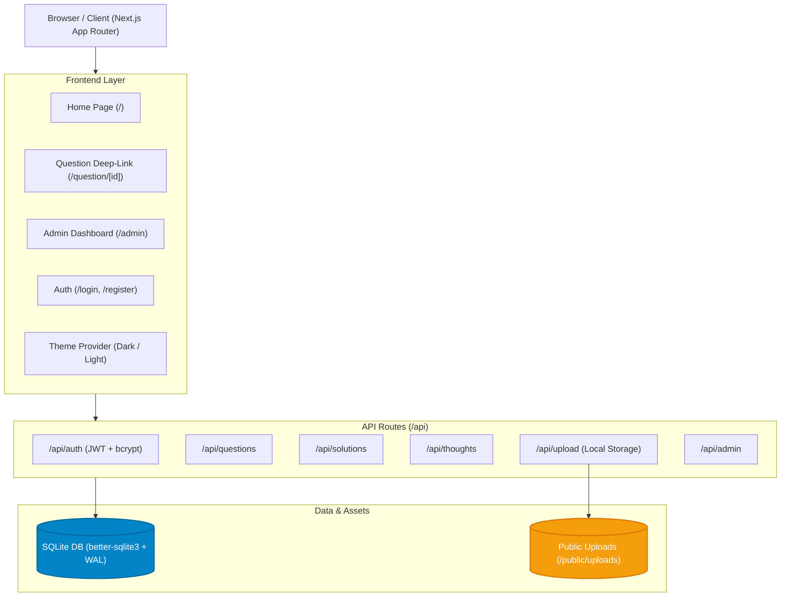
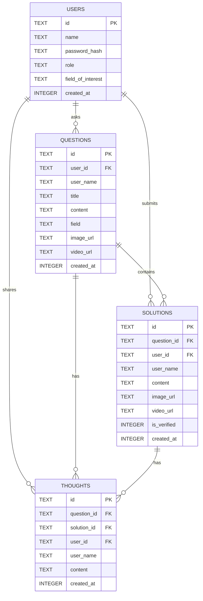

# RecursiveQnA

An interactive, multi-tier academic Q&A platform and discussion ecosystem. Built for students, educators, and researchers to post challenging problems, provide verified multi-media solutions, and engage in recursive, threaded peer discussions.

---

## Table of Contents

- [Overview](#overview)
- [Key Features](#key-features)
- [System Architecture](#system-architecture)
- [Tech Stack](#tech-stack)
- [Getting Started](#getting-started)
  - [Prerequisites](#prerequisites)
  - [Installation](#installation)
  - [Environment Variables](#environment-variables)
  - [Running Locally](#running-locally)
- [Pre-Seeded Demo Accounts](#pre-seeded-demo-accounts)
- [Core Workflows](#core-workflows)
  - [1. Asking a Question](#1-asking-a-question)
  - [2. Submitting & Verifying Solutions](#2-submitting--verifying-solutions)
  - [3. Recursive Thoughts & Discussions](#3-recursive-thoughts--discussions)
  - [4. Media Uploads & Previews](#4-media-uploads--previews)
  - [5. Academic Administrator Dashboard](#5-academic-administrator-dashboard)
- [API Reference](#api-reference)
- [Project Structure](#project-structure)
- [Database Schema](#database-schema)
- [Contributing](#contributing)
- [License](#license)

---

## Overview

**RecursiveQnA** is designed to solve the limitations of standard forum discussions by creating a hierarchical, structured environment:
1. **Questions** are categorized by academic field (Mathematics, Physics, Computer Science, Biology, Chemistry, Literature, General).
2. **Solutions** can be proposed by any student or educator, complete with text, diagrams, and video walkthroughs.
3. Solutions can be marked as **Verified** by administrators or original question authors.
4. **Recursive Thoughts** allow users to comment and debate directly on questions or individual solutions, creating focused discussion trees without cluttering the main solution thread.

---

## Key Features

- **Multi-Media Problem & Solution Submission**:
  - Full support for diagram images (PNG, JPG, WebP up to 20MB) with built-in lightbox preview.
  - Video walkthrough uploads (MP4, WebM up to 100MB) with integrated HTML5 player.
- **Recursive Thought / Discussion Engine**:
  - Contextual comments attached directly to questions or specific solutions.
  - Author and admin badges on comments for transparent academic peer review.
- **Solution Verification**:
  - Verified badges (`✓ VERIFIED`) highlight vetted, correct solutions.
  - Verification controls for question authors and administrators.
- **Academic Administration Panel (`/admin`)**:
  - Comprehensive dashboard displaying platform KPIs, subject breakdown, and real-time activity.
  - Moderation controls to inspect, filter, verify, and delete content across questions, solutions, thoughts, and user accounts.
- **Adaptive Dark / Light Themes**:
  - Custom design system with CSS custom properties (variables) and persistence via `localStorage`.
- **Search & Subject Filtering**:
  - Instant client/server filtering across academic fields and keyword search across titles and descriptions.
- **Deep Linking**:
  - Shareable direct URLs (`/question/[id]`) with copy-link buttons and standalone viewer pages.
- **Embedded High-Performance SQLite**:
  - Powered by `better-sqlite3` with Write-Ahead Logging (WAL) mode enabled for fast, concurrent reads and writes with zero external database dependencies.

---

## System Architecture



---

## Tech Stack

| Layer | Technology | Description |
| :--- | :--- | :--- |
| **Framework** | [Next.js](https://nextjs.org/) (v16 App Router) | React framework for server-rendered & client-side components |
| **UI Library** | [React](https://react.dev/) 19 & TypeScript | Dynamic UI with complete type safety |
| **Icons** | [Lucide React](https://lucide.dev/) | Clean, consistent icons |
| **Styling** | Custom Vanilla CSS Design System | Responsive, theme-aware tokens (`globals.css`) |
| **Database** | [Better-SQLite3](https://github.com/WiseLibs/better-sqlite3) | Fast, file-based SQL database with WAL mode |
| **Authentication** | JWT (`jsonwebtoken`) & `bcryptjs` | HTTP-only cookie-based sessions with hashed passwords |
| **Media Handling** | Native Multipart Form Handler | Stores files directly in `/public/uploads` |

---

## Getting Started

### Prerequisites

- **Node.js**: `v18.17.0` or later (Node.js 20+ recommended)
- **npm** or **yarn** / **pnpm** / **bun**

### Installation

1. **Clone the repository**:
   ```bash
   git clone https://github.com/TheAbhayAlgorithms/recursiveqna.git
   cd recursiveqna
   ```

2. **Install dependencies**:
   ```bash
   npm install
   ```

### Environment Variables

A fallback secret key is configured by default for development. To customize your configuration, create a `.env.local` file in the root directory:

```env
# Optional custom JWT secret (defaults to internal secure key)
JWT_SECRET=your_custom_jwt_secret_key_here

# Next.js Server Port (optional, default is 3000)
PORT=3000
```

### Running Locally

1. **Start the development server**:
   ```bash
   npm run dev
   ```

2. Open your browser and navigate to:
   ```
   http://localhost:3000
   ```

The database (`data/recursiveqna.db`) will automatically initialize and seed with starter accounts and sample questions on the first run.

---

## Pre-Seeded Demo Accounts

The database comes pre-populated with demo accounts for testing different roles:

| Username | Password | Role | Description |
| :--- | :--- | :--- | :--- |
| `admin` | `admin` *(or `admin123`)* | **Academic Administrator** | Full access to `/admin`, moderation, deletion, and solution verification. |
| `alex_student` | `student123` | **Student / User** | Mathematics & CS learner; author of Euler's formula question. |
| `sophia_phy` | `student123` | **Student / User** | Physics & Engineering learner; author of the A* search question. |

*You can also register a new account anytime at `/login?tab=register`.*

---

## Core Workflows

### 1. Asking a Question
1. Click the **"Ask Question"** button on the navigation bar or feed header.
2. Select an academic subject field (e.g. Mathematics, Computer Science, Physics).
3. Provide a clear, descriptive title and detailed question body.
4. *(Optional)* Attach a diagram (PNG/JPG) or video walkthrough.
5. Submit to make the question immediately visible to the community.

### 2. Submitting & Verifying Solutions
1. Click **"Solutions"** or **"Add Solution"** on any question card.
2. Provide your step-by-step breakdown.
3. Attach visual diagrams or screen recordings if applicable.
4. Authors of the question and Administrators can click **"Verify"** on high-quality solutions to award the verified badge.

### 3. Recursive Thoughts & Discussions
1. Inside the question modal or direct question page, open the **Opinions & Thoughts** section.
2. Discussions can be posted directly on the question or anchored to an individual solution.
3. Allows peer-reviewing proofs, debating edge cases, or asking follow-up clarifications.

### 4. Media Uploads & Previews
- Images and videos uploaded via `/api/upload` are validated for size and MIME types.
- Clicking on any diagram opens an interactive lightbox modal with full-resolution zoom.
- Video files stream with full playback controls.

### 5. Academic Administrator Dashboard
- Accessible at `/admin` (accessible only to users with `role: 'admin'`).
- Provides real-time metrics: total questions, solutions, thoughts, registered users, and verification rates.
- Moderation tabs allow inspecting and purging spam or inappropriate entries.

---

## API Reference

### Authentication (`/api/auth`)
- `POST /api/auth/register` — Register a new student/user.
- `POST /api/auth/login` — Authenticate and receive HTTP-only session cookie.
- `POST /api/auth/logout` — Clear session cookie.
- `GET /api/auth/me` — Return the currently logged-in user profile.

### Questions (`/api/questions`)
- `GET /api/questions?field=&search=` — Retrieve questions with optional filtering.
- `POST /api/questions` — Create a new question (requires auth).
- `GET /api/questions/[id]` — Retrieve full question details including solutions and thoughts.
- `DELETE /api/questions/[id]` — Delete a question (Admin only).

### Solutions (`/api/solutions`)
- `POST /api/solutions` — Post a solution to a question (requires auth).
- `PATCH /api/solutions/verify` — Toggle verified status of a solution (Author or Admin).
- `DELETE /api/solutions?id=[id]` — Delete a solution (Admin only).

### Thoughts & Discussions (`/api/thoughts`)
- `GET /api/thoughts?questionId=&solutionId=` — Fetch thoughts by question or solution.
- `POST /api/thoughts` — Add a new thought/comment (requires auth).

### Uploads (`/api/upload`)
- `POST /api/upload` — Multipart form upload for images (≤20MB) and videos (≤100MB).

### Admin (`/api/admin`)
- `GET /api/admin/stats` — Aggregate metrics and content breakdowns.
- `GET /api/admin/content?type=questions|solutions|thoughts|users` — Content lists for moderation.
- `DELETE /api/admin/content` — Admin-level purge endpoint.

---

## Project Structure

```
recursiveqna/
├── app/
│   ├── admin/
│   │   └── page.tsx              # Administrator dashboard & moderation UI
│   ├── api/                      # Next.js App Router API Route handlers
│   │   ├── admin/                # Admin statistics & moderation routes
│   │   ├── auth/                 # Login, register, session verification
│   │   ├── questions/            # Questions CRUD endpoints
│   │   ├── solutions/            # Solutions & verification endpoints
│   │   ├── thoughts/             # Recursive opinions / discussions
│   │   └── upload/               # Media upload handler (images/videos)
│   ├── login/
│   │   └── page.tsx              # Authentication (Login / Register) page
│   ├── question/
│   │   └── [id]/
│   │       └── page.tsx          # Standalone deep-link page for questions
│   ├── globals.css               # Design system & CSS custom properties
│   ├── layout.tsx                # Root layout with theme provider
│   └── page.tsx                  # Main home feed & question explorer
├── components/
│   ├── AddSolutionModal.tsx      # Modal to compose and attach solution
│   ├── AskQuestionModal.tsx      # Modal to post a new academic problem
│   ├── Navbar.tsx                # Top navigation, theme switcher, auth buttons
│   ├── QuestionCard.tsx          # Feed question card component
│   ├── QuestionViewerModal.tsx   # Detailed question & solution viewer modal
│   └── ThemeProvider.tsx         # Context for dark / light theme management
├── data/
│   └── recursiveqna.db           # SQLite database file (WAL mode)
├── lib/
│   ├── auth.ts                   # JWT session helpers & user authentication
│   └── db.ts                     # Database connection & schema migration/seeds
├── public/
│   └── uploads/                  # Local storage for user-uploaded media
├── package.json
└── tsconfig.json
```

---

## Database Schema



---

## Contributing

Contributions are welcome! Please follow these steps:

1. Fork the repository.
2. Create a feature branch: `git checkout -b feature/my-new-feature`.
3. Commit your changes: `git commit -m 'Add some feature'`.
4. Push to the branch: `git push origin feature/my-new-feature`.
5. Open a Pull Request.

---

## License

This project is licensed under the [MIT License](LICENSE) (or standard open-source academic license). Feel free to use, modify, and distribute it for academic or personal projects.
